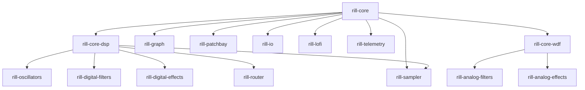

# Rill

[](https://github.com/DigitalRats/rill)
[](https://github.com/DigitalRats/rill)
[](https://github.com/DigitalRats/rill)
[](LICENSE)

Modular signal-processing ecosystem for Rust. 17 crates, from lock-free
queues and generic vector math to real-time audio I/O and analog circuit
modelling.

```
┌─────────────────────────────────────────────────────────────┐
│  rill-osc  │  rill-graph  │  rill-patchbay  │  rill-sampler │
├─────────────────────────────────────────────────────────────┤
│  rill-core-dsp  (Algorithm trait, filters, generators, FX)  │
│  rill-oscillators  │  rill-digital-filters  │  rill-digital  │
│  -effects  │  rill-router  │  rill-lofi                     │
│  rill-core-wdf  │  rill-analog-filters  │  rill-analog      │
│  -effects                                                  │
├─────────────────────────────────────────────────────────────┤
│  rill-io (ALSA / CPAL / PipeWire / JACK)                    │
├─────────────────────────────────────────────────────────────┤
│  rill-core (traits, math, buffers, queues, time, macros)   │
└─────────────────────────────────────────────────────────────┘
```

Most crates are **domain-agnostic** — only `rill-io` and `rill-osc` are
tied to audio hardware. The core (`Scalar`, `Vector`, lock-free queues,
`Interpolate` trait) works in embedded, IoT, robotics, and any signal
processing context.

## Quick start

```toml
[dependencies]
rill-adrift = "0.4"
```

Enable optional features as needed (see table below).

```rust,no_run
use rill_adrift::rill_graph::GraphBuilder;
use rill_adrift::rill_oscillators::audio::SineOsc;

const BUF_SIZE: usize = 256;

let mut builder = GraphBuilder::<f32, BUF_SIZE>::new();
let osc = builder.add_source(
    Box::new(SineOsc::<f32, BUF_SIZE>::new().with_frequency(440.0))
);
// Add processors, sinks, connections via builder...
// Then call builder.build() to obtain the immutable SignalGraph.
```

## Crates

| Crate | Description |
|-------|-------------|
| **rill-core** | Foundation: traits, math, buffers, queues, time, macros |
| **rill-core-dsp** | Algorithm trait, generators, filters, delay, vector ops |
| **rill-core-wdf** | Wave Digital Filter elements and adapters |
| **rill-graph** | Static DAG signal graph with Port::propagate |
| **rill-oscillators** | Sine, saw, noise, LFO, envelope graph nodes |
| **rill-digital-filters** | Biquad, SVF, comb, MoogLadder filter nodes |
| **rill-digital-effects** | Delay, Distortion, Limiter nodes |
| **rill-router** | EQ + mixer + routing |
| **rill-patchbay** | Automation: LFO, envelopes, sequencer, sensors, servos |
| **rill-lofi** | Lo-fi emulation (NES, AY-3-8910, Akai S900) |
| **rill-io** | Audio I/O: ALSA, CPAL, PipeWire, JACK |
| **rill-telemetry** | Real-time probes and collectors |
| **rill-analog-filters** | WDF-based analog filters (MoogLadder) |
| **rill-analog-effects** | Op-amp, tape deck, preamp models |
| **rill-osc** | OSC server and networking |
| **rill-sampler** | Sample playback, time-series reader, WAV loading |
| **rill-adrift** | Umbrella crate (re-exports all) |

## Feature flags (rill-adrift)

| Feature | Enables | Default |
|---------|---------|---------|
| `io` | `rill-io` (audio backends) | yes |
| `lofi` | `rill-lofi` | yes |
| `telemetry` | `rill-telemetry` | yes |
| `osc` | `rill-osc` (tokio) | yes |
| `sampler` | `rill-sampler` | yes |
| `analog` | WDF + analog filters + effects | no |
| `serialization` | Graph/patchbay JSON/CBOR | no |
| `alsa` / `cpal` / `jack` / `pipewire` | Audio backends (implies `io`) | no |

Always-on: `rill-core`, `rill-core-dsp`, `rill-graph`, `rill-oscillators`,
`rill-digital-filters`, `rill-digital-effects`, `rill-router`, `rill-patchbay`.

## Dependencies



## Documentation

- **mdBook guide** — [rill-adrift.io](https://rill-adrift.io) (build locally: `mdbook build docs/`)
- **API docs** — [docs.rs/rill-adrift](https://docs.rs/rill-adrift)
- **Architecture** — `docs/src/architecture/` (core, graph, overview)
- **Changelog** — [CHANGELOG.md](CHANGELOG.md)

## Testing

```bash
cargo test --workspace    # 491 tests, all passing
cargo clippy --workspace  # lint
cargo fmt                 # format (max_width=100)
```

## Publications

All 17 crates publish to [crates.io](https://crates.io) in dependency order.
Use the publish script:

```bash
./scripts/publish.sh            # publish all
./scripts/publish.sh --check    # dry-run
```

## Contributing

1. Fork, create a feature branch (`git flow feature start my-feature`)
2. Run `cargo test --workspace && cargo clippy --workspace`
3. Open a pull request

See [Git Flow guide](docs/src/guides/git-flow.md) for detailed workflow.

## License

Licensed under **Apache 2.0** ([LICENSE.md](LICENSE.md)) or **MIT** ([LICENSE-MIT](LICENSE-MIT))
at your option.
