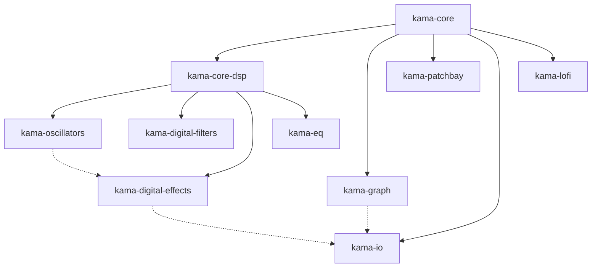

# Архитектура Kama Audio (версия 0.3.0)

## Общая концепция

Kama Audio — это **модульная экосистема**, построенная вокруг минимального ядра с трейтами. Каждый крейт имеет чёткую ответственность и может использоваться независимо. После масштабного рефакторинга 0.3.0 все крейты используют единое ядро `kama-core`.

```
┌─────────────────────────────────────────────────────────────┐
│                         Продукты                             │
│  ┌──────────┐                                                │
│  │  drift   │  (сервер эффектов для live coding)            │
│  └──────────┘                                                │
├─────────────────────────────────────────────────────────────┤
│                       Инфраструктура                          │
│  ┌────────────┐  ┌────────────┐  ┌────────────┐             │
│  │kama-server │  │kama-graph  │  │kama-patchbay│             │
│  │(в разработке)│ │(аудиограф) │ │(автоматизация)│            │
│  └────────────┘  └────────────┘  └────────────┘             │
├─────────────────────────────────────────────────────────────┤
│                      Обработка звука                          │
│  ┌─────────────────────────────────────────────────────┐    │
│  │              kama-core-dsp (DSP инфраструктура)     │    │
│  └─────────────────────────────────────────────────────┘    │
│  ┌──────────┐ ┌──────────┐ ┌──────────┐ ┌──────────┐      │
│  │осцилляторы│ │ фильтры  │ │ эффекты  │ │эквалайзер│      │
│  │(kama-osc)│ │(kama-dig-│ │(kama-dig-│ │(kama-eq) │      │
│  │          │ │ital-filt)│ │ital-eff) │ │          │      │
│  └──────────┘ └──────────┘ └──────────┘ └──────────┘      │
│  ┌──────────┐ ┌──────────┐ ┌──────────┐                   │
│  │  микшер  │ │  lo-fi   │ │   wdf    │                   │
│  │(kama-mix)│ │(kama-lofi)│ │(kama-wdf)│                   │
│  │ временно │ │ временно │ │(в разработке)│                  │
│  │ отключен │ │ отключен │ │          │                   │
│  └──────────┘ └──────────┘ └──────────┘                   │
├─────────────────────────────────────────────────────────────┤
│                      Ввод-вывод                              │
│  ┌──────────┐ ┌──────────┐ ┌──────────┐ ┌──────────┐      │
│  │  ALSA    │ │  CPAL    │ │ PipeWire │ │   JACK   │      │
│  │(kama-io) │ │(kama-io) │ │(kama-io) │ │(kama-io) │      │
│  │ временно │ │ временно │ │ временно │ │ временно │      │
│  │ отключен │ │ отключен │ │ отключен │ │ отключен │      │
│  └──────────┘ └──────────┘ └──────────┘ └──────────┘      │
├─────────────────────────────────────────────────────────────┤
│                         Ядро                                 │
│  ┌─────────────────────────────────────────────────────┐    │
│  │                   kama-core                          │    │
│  │  ┌─────────────┐  ┌─────────────┐                  │    │
│  │  │   traits    │  │   queues    │                  │    │
│  │  │ (трейты)    │  │  (очереди)  │                  │    │
│  │  └─────────────┘  └─────────────┘                  │    │
│  └─────────────────────────────────────────────────────┘    │
└─────────────────────────────────────────────────────────────┘
```

## Единое ядро: kama-core

### Структура

```
kama-core/
├── src/
│   ├── lib.rs           # Корневой модуль, реэкспорты
│   ├── math.rs          # Абстракции числовых типов
│   ├── buffer/
│   │   ├── mod.rs       # Буферы (AlignedBuffer, PipeBuffer)
│   │   ├── pipe.rs      # Прямые соединения
│   │   └── ring.rs      # Кольцевые буферы
│   ├── queue/
│   │   ├── mod.rs       # Очереди (RtQueue)
│   │   ├── spsc.rs      # Single-producer single-consumer
│   │   ├── mpsc.rs      # Multi-producer single-consumer
│   │   └── ring.rs      # Кольцевая очередь
│   ├── port.rs          # Порты и идентификаторы
│   ├── node.rs          # Узлы (Source/Processor/Sink)
│   ├── error.rs         # Система ошибок
│   ├── macros/
│   │   ├── mod.rs       # Макросы
│   │   ├── source.rs    # source_node!
│   │   ├── processor.rs # processor_node!
│   │   ├── sink.rs      # sink_node!
│   │   ├── params.rs    # Вспомогательные макросы для параметров
│   │   └── ports.rs     # Вспомогательные макросы для портов
│   ├── graph.rs         # Базовые типы для графа
│   ├── event.rs         # События и сигналы
│   ├── config.rs        # Конфигурация
│   └── utils.rs         # Утилиты
```

### Ключевые компоненты ядра

#### buffer (буферы)

Предоставляет типы буферов для передачи аудиоданных между узлами: `PipeBuffer` (однопоточный канал), `FanOutBuffer` (разветвление), `FanInBuffer` (суммирование), `DelayLine` (линия задержки), `RingBuffer` (кольцевой буфер). Все буферы реализуют трейт `AudioBuffer` и поддерживают статистику использования.

```rust
use kama_core::buffer::{PipeBuffer, FanOutBuffer, FanInBuffer, DelayLine, RingBuffer};

let mut pipe = PipeBuffer::new(1024);
pipe.write(&[1.0, 2.0, 3.0]);
let read = pipe.read(3);
```

#### macros (макросы)

Содержит макросы для удобного создания узлов: `processor!`, `sink!`, `source!`. Упрощают написание пользовательских процессоров, источников и приёмников без boilerplate кода.

```rust
use kama_core::macros::{processor, sink, source};

processor!(Gain, |sample, _| sample * 0.5);
sink!(Logger, |sample, _| println!("{}", sample));
source!(Silence, || 0.0);
```

#### math (математика)

Определяет трейт `AudioNum` для аудио‑специфичных числовых операций (преобразование дБ, обёртка фазы), а также функции конвертации и утилиты.

```rust
use kama_core::math::AudioNum;

let db = (-6.0).db_to_linear(); // ≈ 0.501
let phase = 3.0.wrap_phase();   // в диапазоне [0, 2π)
```

#### queues (очереди)

Реализует неблокирующие очереди команд и телеметрии для связи между аудио‑графом и внешним миром. Содержит `CommandQueue`, `TelemetryQueue`, `SignalSource`, `MicroControlObserver` и другие компоненты для управления параметрами в реальном времени.

```rust
use kama_core::queues::{CommandQueue, CommandEnum, SetParameter};

let mut queue = CommandQueue::new();
queue.send(CommandEnum::SetParameter(SetParameter {
    node_id: 1,
    param_id: "cutoff".to_string(),
    value: 1000.0,
}));
```

#### time (время)

Абстракции времени и темпа: трейты `Clock` и `TimeProvider`, структуры `SystemClock`, `TickInfo`. Позволяют узлам синхронизироваться с системным временем или внешним темпом.

```rust
use kama_core::time::{Clock, SystemClock};

let clock = SystemClock::new(44100.0);
let pos = clock.position_samples();
clock.advance(64);
```

#### error (ошибки)

Крейт‑уровневые типы ошибок `AudioError` и `AudioResult`. Отделены от `traits/error.rs` (который содержит ошибки трейтов) и используются во всех публичных API ядра.

```rust
use kama_core::{AudioError, AudioResult};

fn safe_process() -> AudioResult<()> {
    Ok(())
}
```

#### prelude (прелюдия)

Удобный реэкспорт наиболее часто используемых типов из всех модулей ядра. Рекомендуется импортировать `use kama_core::prelude::*;` в пользовательском коде.

```rust
use kama_core::prelude::*;
// Теперь доступны AudioNode, AudioNum, PipeBuffer, CommandQueue, Clock и др.
```

## Инфраструктурные крейты


### `kama-graph` (0.3.0)
Аудиограф с топологической сортировкой.

```rust
let mut graph = AudioGraph::new(44100.0);
let osc_id = graph.add_node(Box::new(SineOsc::new(440.0)));
let filter_id = graph.add_node(Box::new(BiquadFilter::lowpass(1000.0, 0.707)));

graph.connect(PortId::output(osc_id, 0), PortId::input(filter_id, 0), 1.0)?;

// Автоматическая топологическая сортировка
for &node_id in graph.processing_order() {
    // узлы в правильном порядке
}
```

#### Архитектура аудио-графа

Граф Kama Audio построен на строгой математической основе — **теории категорий**, что обеспечивает типобезопасность, композиционность и предсказуемость поведения.

**Ключевые концепции:**

- **Объекты** — блоки семплов фиксированного размера (`[T; BUF_SIZE]`), значения управления (`Control`) и тактовые сигналы (`Clock`).
- **Стрелки (морфизмы)** — процессоры, преобразующие блоки (источники `Source`, процессоры `Processor`, приёмники `Sink`).
- **Композиция** — последовательное соединение узлов образует цепочку обработки.
- **Произведение** — параллельная обработка нескольких сигналов (например, многоканальный миксер).

**Типы портов:** каждый порт характеризуется типом сигнала (`Audio`, `Control`, `Clock`, `Feedback`, `Param`), направлением (вход/выход) и индексом.

**Топологическая сортировка:** граф автоматически определяет порядок обработки узлов, исключая циклические зависимости (за исключением преднамеренных петель обратной связи).

**Реальное время:** все операции над графом гарантированно выполняются за ограниченное время, что критично для аудио‑приложений.

**Блочная обработка:** данные передаются блоками фиксированного размера, что улучшает производительность за счёт локальности кэша и позволяет использовать SIMD‑оптимизации.

### `kama-patchbay` (0.3.0, временно отключен)
Автоматизация параметров — унификация крейтов `kama-automation` и `kama-control`. Представляет собой центральный фреймворк автоматов (LFO, огибающие, случайные блуждания, логика, математика), сенсоров (акустические, физические, MIDI/CV) и сервоприводов, связанных неблокирующими очередями команд и телеметрии. Подробности см. в разделе «Мир автоматов».

```rust
let mut patchbay = Patchbay::new("Моя Студия");
patchbay.create_lfo("vibrato");
patchbay.create_envelope("amp");

// Добавление сенсора
patchbay.add_sensor(Box::new(
    AcousticSensor::new("pitch", Box::new(PitchDetector::new(44100.0)))
        .listening_to("osc_out")
));

// Добавление сервопривода
patchbay.add_servo(Box::new(
    Servo::new("vibrato_servo", 
        patchbay.get_automaton("vibrato")?,
        ParameterTarget::new(osc_port, ParameterId::new("frequency")?, 400.0, 480.0))
));

patchbay.awaken();  // Автоматы начинают жить своей жизнью
```


### `kama-tests` (планируется)

`kama‑tests` — планируется (набор тестовых утилит и примеров).

## DSP инфраструктура

### `kama-core-dsp` (0.3.0)
Общие утилиты для DSP.

```rust
// Создание узла из функции
let gain_node = stateless_fn_node(
    "Gain",
    NodeCategory::Effect,
    |sample, ctx| sample * 0.5
);

// Макросы для упрощения
effect!(Gain, |sample, ctx| sample * 0.5);
filter!(LowPass, |sample, ctx| sample * 0.5 + ctx.seconds().sin() * 0.1);
```

### `kama-oscillators` (0.3.0)
Унифицированные осцилляторы.

```rust
// Аудио осцилляторы (20Hz - 20kHz)
let sine = SineOsc::new(440.0).with_amplitude(0.5);
let saw = SawOsc::new(220.0).with_bandlimited(true);

// LFO для модуляции (0.01Hz - 100Hz)
let lfo = Lfo::new(1.0, 0.5, 0.0).with_waveform(LfoWaveform::Triangle);

// Огибающие
let mut envelope = Envelope::new(0.01, 0.1, 0.7, 0.2);
envelope.trigger();
```

### `kama-digital-filters` (0.3.0)
Цифровые фильтры.

```rust
let lp = BiquadFilter::new(FilterType::LowPass, 1000.0, 0.707, 0.0);
let hp = BiquadFilter::new(FilterType::HighPass, 200.0, 0.707, 0.0);
let peak = BiquadFilter::new(FilterType::Peak, 1000.0, 2.0, 6.0);
```

### `kama-digital-effects` (0.3.0)
Цифровые эффекты.

```rust
let delay = Delay::new(0.3, 0.4, 0.7);
let distortion = Distortion::new(DistortionType::SoftClip, 2.0, 0.8);
let limiter = Limiter::new(-3.0, 0.005, 0.1, 1.0);
```

### `kama-eq` (0.3.0)
Эквалайзеры.

```rust
// Параметрический эквалайзер с 5 полосами
let mut para_eq = ParametricEq::new(BiquadFactory, 5, 44100.0);
para_eq.set_band(0, 100.0, 1.0, 3.0)?;

// Графический эквалайзер (1/3 октавы, 31 полоса)
let graphic_eq = GraphicEq::new_third_octave(BiquadFactory, 44100.0);
```

### `kama-mixer` (0.2.0, временно отключен)
Микшер с каналами и aux шинами.

```rust
let mut mixer = MixerNode::new(4, 2);
mixer.set_channel_pan(0, -0.5)?;
mixer.set_channel_volume(1, 0.8)?;
```

## Специализированные крейты

### `kama-lofi` (0.2.0, временно отключен)
Lo-Fi эмуляция классических систем.

```rust
// NES эмулятор
let mut nes = NesEmulator::new(44100.0);

// Akai S900 (12-bit)
let akai_config = LofiConfig::for_system(ClassicSystem::AkaiS900);
let mut akai = LofiProcessor::new(akai_config);
```


### `kama-io` (0.2.0, временно отключен)
Аудио ввод-вывод.

```rust
pub trait AudioBackend: Send + Sync {
    fn name(&self) -> &'static str;
    fn init(&mut self) -> IoResult<()>;
    fn start(&mut self) -> IoResult<()>;
    fn read(&mut self, buffer: &mut [f32]) -> IoResult<usize>;
    fn write(&mut self, buffer: &[f32]) -> IoResult<usize>;
}

// Основной движок
pub struct AudioEngine<B: AudioBackend, P: AudioProcessor> {
    backend: B,
    processor: P,
    // ...
}
```

## Ключевые принципы архитектуры

1. **Единое ядро** — `kama-core` объединяет все базовые трейты и сигнальную систему
2. **Минимальные зависимости** — каждый крейт зависит только от того, что реально использует
3. **Модульность** — каждый крейт имеет чёткую ответственность
4. **Композиция** — сложные узлы строятся из простых
5. **Производительность** — zero-cost abstractions, real-time safety
6. **Тестируемость** — все компоненты тестируются изолированно

## Зависимости между крейтами (версия 0.3.0)

Диаграмма зависимостей между крейтами (сплошные стрелки — обязательные зависимости, пунктирные — опциональные):



## Мир автоматов

**Kama Patchbay** — это не просто система управления. Это **мир**, в котором живут **автоматы** — загадочные существа, которые чувствуют окружающую среду и влияют на неё. Они общаются на языке сигналов, слышат звук через сенсоры и через серво воздействуют на AudioGraph.

### 🧠 Архитектура мира

```
┌─────────────────────────────────────────────────────┐
│                 МИР АВТОМАТОВ                         │
│  (ваше приложение на Kama Audio)                      │
│                                                       │
│  ┌─────────────────────────────────────────────────┐ │
│  │                    PATCHBAY                       │ │
│  │  ┌─────────────────────────────────────────┐    │ │
│  │  │           АВТОМАТЫ (разум)              │    │ │
│  │  │  ┌──────────┐  ┌──────────┐  ┌──────────┐ │ │
│  │  │  │   LFO    │  │   ENV    │  │  RANDOM  │ │ │
│  │  │  └────┬─────┘  └────┬─────┘  └────┬─────┘ │ │
│  │  │       │             │             │       │ │
│  │  └───────┼─────────────┼─────────────┼───────┘ │ │
│  │          │             │             │         │ │
│  │          ▼             ▼             ▼         │ │
│  │  ┌─────────────────────────────────────────┐   │ │
│  │  │           СЕНСОРЫ (чувства)              │   │ │
│  │  │  • Слышат звук (акустические)           │   │ │
│  │  │  • Чувствуют прикосновения (физические) │   │ │
│  │  │  • Видят MIDI/CV                         │   │ │
│  │  └─────────────────────────────────────────┘   │ │
│  │                   │                              │ │
│  │                   │ Сигналы                      │ │
│  │                   ▼                              │ │
│  │  ┌─────────────────────────────────────────┐   │ │
│  │  │           СЕРВО (руки)                   │   │ │
│  │  │    Применяют сигналы к AudioGraph       │   │ │
│  │  └─────────────────────────────────────────┘   │ │
│  └──────────────────────┬──────────────────────────┘ │
│                         │ Неблокирующие очереди      │
│                         ▼ (Command/Telemetry)        │
│  ┌─────────────────────────────────────────────────┐ │
│  │                 AUDIOGRAPH                        │ │
│  │          (внутренняя схема устройства)            │ │
│  │                                                   │ │
│  │  Осцилляторы → Фильтры → Эффекты → Микшер        │ │
│  └─────────────────────────────────────────────────┘ │
└─────────────────────────────────────────────────────┘
```

### 🦾 Автоматы — разум (Automaton)

Автоматы — это разумные существа, которые принимают решения и генерируют сигналы. Они могут быть простыми (LFO, огибающая) или сложными (логические схемы, математические преобразователи).

| Автомат | Описание | Как выглядит в коде |
|---------|----------|---------------------|
| **LFO** | Пульсирует с заданной частотой | `LfoAutomaton::new("vibrato").with_frequency(5.0)` |
| **Envelope** | Реагирует на события (нажатия) | `EnvelopeAutomaton::new("amp").with_adsr(0.01, 0.1, 0.7, 0.2)` |
| **Random Walk** | Блуждает случайным образом | `RandomWalkAutomaton::new("chaos").with_step(0.1)` |
| **Logic** | Принимает логические решения | `AndAutomaton::new("gate")` |
| **Math** | Вычисляет | `SumAutomaton::new("mixer")` |

### 👁️ Сенсоры — чувства (Sensors)

Чтобы автоматы могли воспринимать мир, им нужны органы чувств. Сенсоры преобразуют внешние воздействия в сигналы, понятные автоматам.

#### Акустические сенсоры (слышат звук)

```rust
// Слышит высоту тона
let pitch = AcousticSensor::new("pitch", 
    Box::new(PitchDetector::new(44100.0)))
    .listening_to("osc1_out");  // Слушает выход осциллятора

// Слышит громкость
let envelope = AcousticSensor::new("envelope",
    Box::new(EnvelopeFollower::new(44100.0)
        .with_attack(0.01)
        .with_release(0.1)))
    .listening_to("vca_out");

// Слышит ритм (пересечения нуля)
let rhythm = AcousticSensor::new("rhythm",
    Box::new(ZeroCrossing::new(44100.0)))
    .listening_to("kick_out");
```

#### Физические сенсоры (чувствуют прикосновения)

```rust
// Ручка на передней панели
let cutoff = PhysicalSensor::knob("filter_cutoff")
    .with_range(20.0, 20000.0)
    .with_curve(KnobCurve::Logarithmic);

// Кнопка
let button = PhysicalSensor::button("arpeggio_on");

// Переключатель
let mode = PhysicalSensor::switch("filter_mode")
    .with_positions(vec!["LPF", "BPF", "HPF"]);
```

#### MIDI/CV сенсоры (видят внешний мир)

```rust
// MIDI сенсор
let midi_note = MidiSensor::note("keyboard")
    .with_channel(1);

// CV сенсор (Control Voltage)
let cv_in = CvSensor::new("expression")
    .with_range(0.0, 5.0);
```

### 🎯 Серво — руки (Servo)

Серво — это **исполнительные механизмы** автоматов. Подчиняясь законам природы (неблокирующим очередям), они передают сигналы из мира автоматов в AudioGraph, изменяя параметры звука.

```rust
// Серво, управляющее частотой фильтра
let filter_servo = Servo::new(
    "filter_servo",
    lfo_automaton,  // Какой автомат дает сигнал
    ParameterTarget::new(
        filter_port,
        ParameterId::new("cutoff")?,
        20.0, 20000.0
    )
);

// Серво с обратной связью (адаптивное)
let adaptive_servo = Servo::new(
    "adaptive_servo",
    envelope_automaton,
    ParameterTarget::new(vca_port, ParameterId::new("gain")?, 0.0, 1.0)
).with_feedback(pitch_sensor);  // Может корректировать поведение на основе услышанного
```

### ⚡ Законы природы (неблокирующие очереди)

Мир автоматов и мир звука существуют параллельно. Они связаны **неблокирующими очередями**:

- **Command Queue** — серво отправляют команды в AudioGraph
- **Telemetry Queue** — сенсоры получают данные из AudioGraph

Это позволяет автоматам "думать" в своем темпе, не мешая звуковому потоку.

### 🏭 Пространство автоматов (Patchbay)

**Patchbay** — это место, где живут все ваши автоматы, где расположены их чувства и руки.

```rust
// Создаем новое пространство
let mut world = Patchbay::new("Моя Студия");

// Добавляем автоматы (разум)
world.create_lfo("vibrato");
world.create_envelope("amp");

// Добавляем сенсоры (чувства)
world.add_sensor(Box::new(
    AcousticSensor::new("pitch", Box::new(PitchDetector::new(44100.0)))
        .listening_to("osc_out")
));

// Добавляем серво (руки)
world.add_servo(Box::new(
    Servo::new("vibrato_servo", 
        world.get_automaton("vibrato")?,
        ParameterTarget::new(osc_port, ParameterId::new("frequency")?, 400.0, 480.0))
));

// Оживляем мир
world.awaken();  // Автоматы начинают жить своей жизнью
```

## Планы на 0.3.0

- ⚡ **Двухпоточная автоматизация** — разделение на control-поток и audio-поток
- 🌐 **kama-server** — выделение OSC в отдельный крейт
- 🔌 **Унификация IO** — объединение audio/MIDI/CV в kama-io

### 🧪 Тестирование

Kama Audio использует комплексную систему тестирования. Для запуска всех тестов выполните:

```bash
# Все тесты
cargo test --workspace

# Интеграционные тесты
cargo test -p kama-tests -- --nocapture

# Тесты конкретного крейта
cargo test -p kama-digital-effects
```

### 📚 Документация

- [README.md](README.md) — общее описание проекта и быстрый старт
- [Архитектура проекта](architecture.md) — детальное описание всех компонентов
- [План разработки](plan.org) — текущие задачи и планы
- [Примеры](examples/) — примеры использования каждого крейта

### 📄 Лицензия

Проект распространяется под лицензией **Apache 2.0**. Это означает, что вы можете:

- ✅ Использовать в коммерческих продуктах
- ✅ Модифицировать и распространять
- ✅ Использовать патентные права
- ❗ При изменениях указывать авторов
- ❗ Сохранять уведомление об авторстве

Полный текст лицензии: [LICENSE-APACHE](LICENSE-APACHE)

Примечание: kama-tests лицензирован под MIT. Полный текст лицензии: [LICENSE-MIT](LICENSE-MIT)

## Заключение

Архитектура Kama Audio версии 0.3.0 обеспечивает:

- ✅ **Стабильное ядро** — единый крейт с чётким API
- ✅ **Чистую модульность** — каждый крейт имеет свою ответственность
- ✅ **Производительность** — оптимизирована для real-time
- ✅ **Надёжность** — все компоненты тщательно протестированы
- ✅ **Расширяемость** — легко добавлять новые эффекты и бэкенды
- ✅ **Согласованность** — все крейты используют одну версию ядра

Ядро стабилизировано и готово к следующему этапу развития.