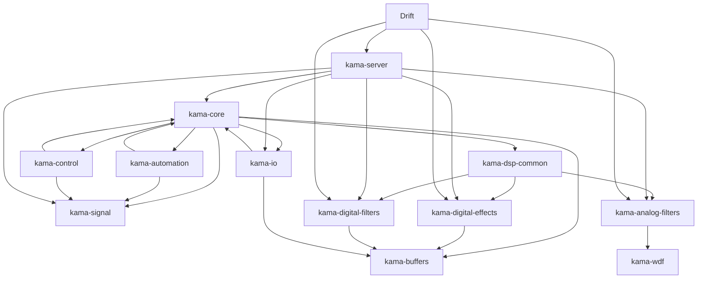

## Kama Audio: Архитектура проекта

### Общая концепция
Kama Audio — это модульный open-source фреймворк для создания аудиоприложений на Rust. Ключевая идея: минимальное стабильное ядро + набор специализированных крейтов, расширяющих функциональность. На базе фреймворка строятся конкретные продукты (например, Drift — сервер эффектов для live coding).

### Структура крейтов

#### 1. Базовые крейты (ядро и фундаментальные абстракции)
| Крейт | Назначение | Ключевые компоненты |
|-------|------------|---------------------|
| **kama-core** | Минимальное ядро | `AudioNode`, `Parameter`, `AudioGraph`, `NodeId`, `PortId`, `Connection`, `NodeFactory` (реестр), `TimeProvider`, `SystemClock`, базовый `AudioError` |
| **kama-signal** | Сигнальная система | `Signal` (маркер), `ParameterChanged`, `ClockTick`, `SystemEvent`, `SignalBus<T>`, `BusConfig`, `OverflowPolicy` |

#### 2. Утилитарные крейты
| Крейт | Назначение | Ключевые компоненты |
|-------|------------|---------------------|
| **kama-buffers** | Работа с буферами | `RingBuffer`, `BufferPool`, `DelayLine`, `MultiHeadBuffer` |
| **kama-io** | Аудиоввод-вывод | `AudioBackend` (трейт), реализации: `JackBackend`, `PipeWireBackend`, `AlsaBackend`, `CpalBackend`, `NullBackend`; конфигурация, управление потоками |
| **kama-control** | Управление (MIDI, OSC, HID) | `ControlBackend` (трейт), `MidiBackend`, `HidBackend`, `OscBackend`; маппинг событий на параметры, `ControlNode` |

#### 3. Автоматизация и роботы
| Крейт | Назначение | Ключевые компоненты |
|-------|------------|---------------------|
| **kama-automation** | Автоматизация параметров | `Automaton` (трейт), `Servo`, `AutomationManager`, готовые автоматы: `LfoAutomaton`, `EnvelopeAutomaton`, `RandomAutomaton` |

#### 4. DSP-крейты (цифровая и аналоговая обработка)
Общий вспомогательный крейт:
| Крейт | Назначение | Ключевые компоненты |
|-------|------------|---------------------|
| **kama-dsp-common** | Общие утилиты для DSP | `DspContext` (время, параметры, сигналы, буферы), `Stateful` (трейт), конструкторы функциональных узлов (`stateless_fn_node`, `stateful_fn_node`) |

Далее — конкретные реализации эффектов (разделены на цифровые и аналоговые для ясности происхождения алгоритмов):

| Крейт | Назначение | Зависимости |
|-------|------------|-------------|
| **kama-digital-filters** | Цифровые фильтры (Biquad, эллиптические, Чебышёва) | `kama-dsp-common`, `kama-core` |
| **kama-digital-effects** | Цифровые эффекты (дисторшн, задержка, хорус, реверберация Freeverb, простой компрессор) | `kama-dsp-common`, `kama-buffers` (для задержек) |
| **kama-digital-eq** | Цифровые эквалайзеры (параметрический на основе фильтров) | `kama-dsp-common`, `kama-digital-filters` |
| **kama-analog-filters** | Аналоговые фильтры (Moog ladder, WDF-модели) | `kama-dsp-common`, `kama-wdf` |
| **kama-analog-effects** | Аналоговые эффекты (диодный клиппер, ленточная сатурация, ламповый дисторшн) | `kama-dsp-common`, `kama-wdf`, `kama-buffers` |
| **kama-analog-eq** | Аналоговые эквалайзеры (модели пультовых EQ) | `kama-dsp-common`, `kama-wdf`, `kama-analog-filters` |

#### 5. Специализированные крейты
| Крейт | Назначение | Ключевые компоненты |
|-------|------------|---------------------|
| **kama-wdf** | Wave Digital Filters для аналоговой эмуляции | `WdfElement`, `Resistor`, `Capacitor`, `Diode`, адаптеры, готовые модели (`CassetteDeckModel`, `MoogLadderFilter`) |
| **kama-hp** | High-precision вычисления (f64) | `HighPrecisionBuffer`, высокоточные осцилляторы, фильтры, эффекты |
| **kama-mixer** | Микшер и маршрутизация | `BasicMixer`, каналы, шины, посылы, фильтры каналов |

#### 6. Инфраструктурные крейты
| Крейт | Назначение | Ключевые компоненты |
|-------|------------|---------------------|
| **kama-server** | Универсальный сервер для продуктов | OSC-сервер, обработчики команд (`/node/add`, `/connect`, `/graph/get`), интеграция с реестром фабрик, управление графом, поддержка `TimeProvider` и `SignalBus` |
| **kama-client** | CLI-утилита для отладки | Подключение к серверу, отправка команд, получение состояния, генерация DOT-графов |

#### 7. Продукты
| Продукт | Назначение | Зависимости |
|---------|------------|-------------|
| **Drift** | Сервер эффектов для live coding | `kama-server`, все DSP-крейты (цифровые для MVP, позже и аналоговые), специфичные узлы Drift (`tape_echo`, `lofi_looper`) |
| **Drift Studio** (будущее) | Графический интерфейс для Drift | `egui` / `eframe`, подключается к серверу по OSC/WebSocket |

### Взаимодействие между крейтами
- Все крейты зависят от `kama-core` (минимальное ядро).
- DSP-крейты могут зависеть от `kama-dsp-common`, `kama-buffers`, `kama-wdf`.
- `kama-server` зависит от `kama-core`, `kama-signal`, `kama-io` (для бэкендов), а также от DSP-крейтов (через реестр узлов).
- Продукты (Drift) собирают все необходимые зависимости и добавляют свою логику.

### Ключевые архитектурные решения
- **Минимальное ядро**: только трейты, граф, параметры, время, реестр фабрик, ошибки.
- **Реестр фабрик узлов**: позволяет создавать узлы по имени, основа для динамической загрузки.
- **TimeProvider**: единый источник времени для всех компонентов (аудиопоток, автоматизация, транспорт).
- **SignalBus**: гибкая шина событий с настраиваемыми каналами для разных типов сигналов (параметры, телеметрия, события).
- **DSP как эффект в контексте**: DSP-узлы строятся из функций, получающих контекст (`DspContext`) с доступом к времени, параметрам, сигналам и буферам.
- **Разделение на цифровые и аналоговые крейты**: пользователь сразу понимает природу алгоритма (математическая модель vs физическое моделирование).
- **Клиент-серверная модель**: сервер (`kama-server`) отвечает за звук, клиенты (CLI, GUI, live coding среды) управляют им по OSC/WebSocket.
- **Протокол взаимодействия** (в разработке): единый набор OSC-команд для управления любым совместимым сервисом (discovery, транспорт, параметры, граф).

### Зависимости между крейтами (упрощённо)

### Роль каждого крейта в продукте Drift
- **kama-server** обеспечивает OSC-интерфейс и управление графом.
- **kama-core** предоставляет базовые типы и граф.
- **kama-signal** используется для внутренней коммуникации (например, роботы отправляют сигналы об изменении параметров).
- **kama-io** обеспечивает JACK/PipeWire бэкенды.
- **kama-control** добавляет поддержку MIDI-контроллеров.
- **kama-automation** реализует роботов (LFO, огибающие, случайные генераторы).
- **kama-buffers** используется в эффектах, требующих буферизации (задержки, гранулярный синтез).
- **kama-dsp-common** упрощает создание новых эффектов.
- Цифровые и аналоговые DSP-крейты поставляют готовые узлы для обработки звука.

### Заключение
Такая архитектура обеспечивает:
- **Модульность**: каждый крейт можно развивать независимо.
- **Расширяемость**: новые эффекты добавляются через реестр фабрик.
- **Производительность**: минимальные накладные расходы, zero-cost абстракции.
- **Гибкость**: поддержка разных сценариев (live coding, GUI, плагины) через единый протокол.
- **Понятность**: чёткое разделение на цифровые и аналоговые алгоритмы помогает пользователям выбирать нужное.

Данный документ служит картой для дальнейшей разработки и навигации по проекту.