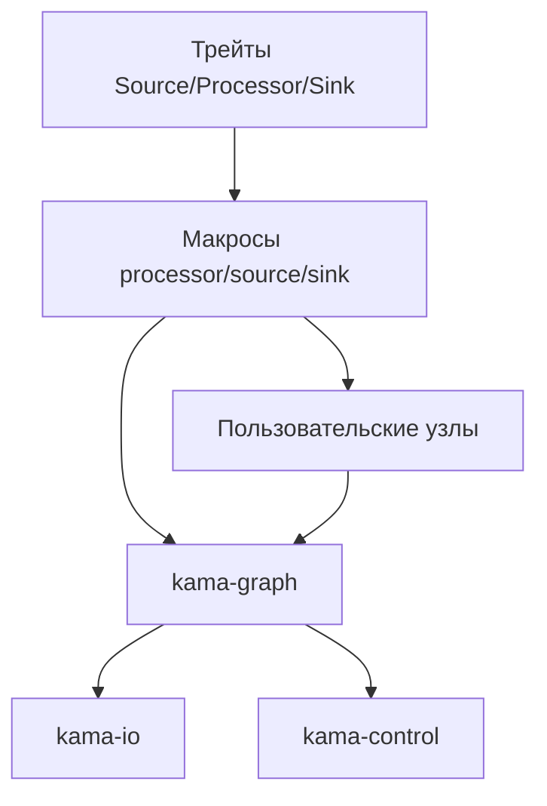

# План модификации макроопределений для использования AudioNum вместо f32

## Текущее состояние

Трейты `Source<T>`, `Processor<T>`, `Sink<T>` в `kama-core/src/traits/node.rs` уже параметризованы типом `T`, ограниченным `AudioNum`. Это позволяет использовать любой числовой тип, реализующий трейт `AudioNum` (f32, f64, i16, i32 и т.д.).

Макросы в `kama-core/src/macros/` (processor.rs, source.rs, sink.rs) предоставляют удобный способ создания узлов, но содержат жёстко закодированные `f32` в нескольких местах:

1. Поля `sample_rate` и `control_values` имеют тип `f32` (или `Vec<f32>`), хотя контрольные значения в трейтах также используют `f32`.
2. Замыкание `after_param_change_closure` в processor.rs ожидает параметр типа `f32`.
3. Преобразование параметров в `ParamValue::Float` предполагает, что параметры имеют тип `f32`.
4. Внутренние вычисления в пользовательских замыканиях могут использовать литералы `f32`, что может вызвать проблемы при использовании других типов.

## Цель

Обеспечить полную поддержку `AudioNum` в макроопределениях, чтобы пользователи могли создавать узлы с произвольным типом аудио‑сигнала, не сталкиваясь с неявными ограничениями на `f32`.

## Предлагаемые изменения

### 1. Обобщение полей `sample_rate` и `control_values`

В настоящее время поля `sample_rate` и `control_values` объявлены как `f32` и `Vec<f32>` соответственно. Однако трейты ожидают `f32` для контроля и частоты дискретизации (сигнатуры методов используют `f32`). Это разумно, потому что контрольные значения и частота дискретизации — это всегда числа с плавающей точкой одинарной точности в аудио‑графе. Поэтому изменять эти поля на обобщённый тип не требуется.

**Действие:** Оставить как есть.

### 2. Замыкание `after_param_change_closure` в processor.rs

В строке 250 файла `processor.rs` определена заглушка:
```rust
|_this: &mut Self, _param: &str, _value: f32| {}
```
Это замыкание используется, когда пользователь не предоставляет свой обработчик. Параметр `_value` должен иметь тот же тип, что и параметр узла (который может быть не `f32`). Сейчас параметры всегда `f32` (см. ниже), но для общности стоит использовать обобщённый тип.

**Действие:** Заменить `f32` на `$type` в этом замыкании. Для этого необходимо передать `$type` во внутреннее правило макроса `@after_param_change_inner`. Предложенная модификация:

```diff
- (@after_param_change_inner) => {
-     |_this: &mut Self, _param: &str, _value: f32| {}
- };
+ (@after_param_change_inner $type:ty) => {
+     |_this: &mut Self, _param: &str, _value: $type| {}
+ };
```

И вызвать это правило с указанием типа: `$crate::processor_node!(@after_param_change_inner $type)`.

### 3. Поддержка параметров разных типов

Сейчас макрос предполагает, что все параметры имеют тип `f32` и преобразует их в `ParamValue::Float`. Это ограничивает пользователей только типами, приводимыми к `f32`. Трейт `ParamValue` поддерживает также `Int(i32)` и `Bool(bool)`. Чтобы обеспечить полную гибкость, можно расширить макрос для автоматического определения типа параметра и выбора соответствующего варианта `ParamValue`.

Однако это значительное усложнение и выходит за рамки задачи «использовать AudioNum вместо f32». Поскольку AudioNum относится к типу аудио‑сигнала, а параметры могут быть любого типа, предлагается оставить текущее поведение (параметры — `f32`). Если пользователю нужны параметры другого типа, он может реализовать трейт вручную.

**Действие:** Оставить без изменений.

### 4. Обновление kama‑graph для совместимости

Модуль `kama‑graph` в настоящее время использует специализированные трейты `Processor<BUF_SIZE>` и `PipeBuffer<f32, BUF_SIZE>`. После перехода на обобщённые трейты необходимо обновить импорты и типы.

**Конкретные изменения:**

- В `kama-graph/src/graph.rs` заменить `use kama_core::traits::processor::{Processor, ProcessResult};` на `use kama_core::traits::{Processor, ProcessResult};`.
- Изменить тип `audio_nodes` с `Box<dyn Processor<BUF_SIZE, Sample = f32>>` на `Box<dyn Processor<f32, BUF_SIZE>>` (пока сохраняем `f32` как тип по умолчанию).
- Аналогично обновить `audio_connections`: `PipeBuffer<f32, BUF_SIZE>` → `PipeBuffer<f32, BUF_SIZE>` (без изменений, т.к. тип уже `f32`).
- В тестах заменить `Processor<BUF_SIZE>` на `Processor<f32, BUF_SIZE>`.

### 5. Создание моков для тестирования графа с активными Source и Sink

Для проверки работы графа в режимах Producer, Consumer, Bridge, Processor потребуются моки, имитирующие аудио‑стек операционной системы (например, источник, который генерирует сигнал, и приёмник, который его потребляет).

**Действие:** Создать в каталоге `kama‑graph/tests/` (или в отдельном модуле) заглушки:

- `MockSource` – реализует `Source<f32, BUF_SIZE>` и выдаёт тестовый сигнал (например, тишину или синус).
- `MockSink` – реализует `Sink<f32, BUF_SIZE>` и сохраняет полученные сэмплы в вектор для последующей проверки.
- `MockProcessor` – простой процессор (например, усилитель) для проверки цепочки обработки.

### 6. Написание интеграционных тестов

Добавить тесты, которые:

1. Создают граф в режиме `Producer` (только Source) и убеждаются, что сигнал генерируется.
2. Создают граф в режиме `Consumer` (только Sink) и проверяют, что данные потребляются.
3. Тестируют полный цикл Source → Processor → Sink.
4. Проверяют корректность обработки управляющих сигналов (control inputs).

### 7. Запуск всех тестов

После внесения изменений запустить `cargo test` во всех затронутых крейтах (`kama‑core`, `kama‑graph`, `kama‑core‑dsp` и т.д.) и убедиться, что никакие существующие тесты не сломаны.

## Оценка рисков

- Изменение сигнатуры `after_param_change_closure` может сломать код пользователей, которые используют эту возможность с явным указанием типа `f32`. Однако, поскольку параметры по‑прежнему `f32`, риск минимален.
- Обновление `kama‑graph` может потребовать адаптации других крейтов, которые от него зависят (`kama‑io`, `kama‑control`). Необходимо проверить, что эти крейты собираются.
- Если где‑то в коде используются специализированные трейты из `kama_core::traits::processor`, их нужно заменить на обобщённые.

## Приоритетность

1. Исправить макрос `processor_node` (пункт 2).
2. Обновить `kama‑graph` (пункт 4).
3. Создать моки и тесты (пункты 5‑6).
4. Прогнать тесты (пункт 7).

## Диаграмма зависимостей



## Следующие шаги

После утверждения плана необходимо переключиться в режим **Code** и выполнить указанные изменения файл за файлом. Рекомендуется придерживаться порядка приоритетов и после каждого шага запускать тесты, чтобы быстро выявлять регрессии.

---
*План составлен на основе анализа кода от 2026‑03‑01.*